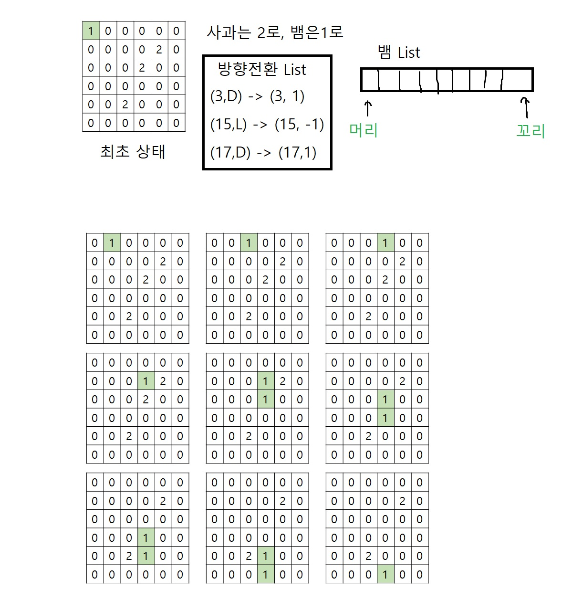

## [백준 3190 뱀](https://acmicpc.net/problem/3190)

```
1. 사과는 배열에서 2로 표시한다.
2. 뱀은 1로 표시한다.
3. 빈공간은 0으로 표시한다.
4. 뱀길이가 늘어날때마다 List로 관리해서 머리, 꼬리를 이용해 길이를 늘리고, 꼬리부분을 0으로 만든다.
5. 뱀이 인덱스를 벗어나거나, 자신의 몸인 1에 닿으면, 움직임을 종료한다.
6. 방향전환은 리스트에 넣고, 매 초가 지날때마다 방향전환을 해야하는지 확인 후, 
    방향전환을 했다면리스트에서 제거한다.

    밑의 그림은, 
6
3
3 4
2 5
5 3
3
3 D
15 L
17 D

다음의 예제를 사용함. 9초뒤에 인덱스를 벗어나므로 종료된다.
```
