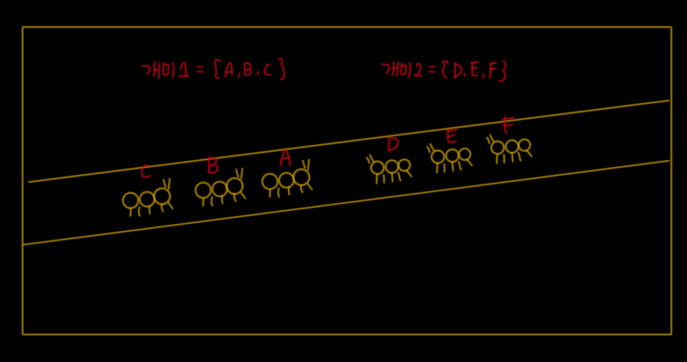
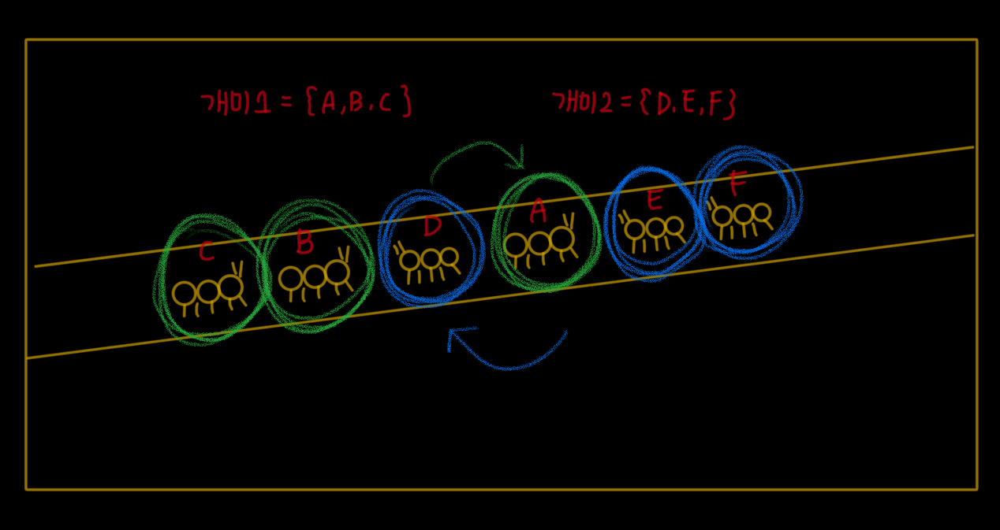

개미 - [3048](https://www.acmicpc.net/problem/3048)
===
---


문제
---
~~~
개미가 일렬로 이동할 때, 가장 앞의 개미를 제외한 나머지 개미는 모두 앞에 개미가 한 마리씩 있다. 

서로 반대 방향으로 이동하던 두 개미 그룹이 좁은 길에서 만났을 때, 개미는 어떻게 지나갈까?

최근 연구에 의하면 위와 같은 상황이 벌어지면 개미는 서로를 점프해서 넘어간다고 한다.

즉, 두 그룹이 만났을 때, 1초에 한번씩 개미는 서로를 뛰어 넘는다. (한 개미가 다른 개미를 뛰어 넘고, 다른 개미는 그냥 전진한다고 생각해도 된다)

하지만 모든 개미가 점프를 하는 것은 아니다. 자신의 앞에 반대 방향으로 움직이던 개미가 있는 경우에만 점프를 하게 된다.

첫 번째 그룹이 ABC로 움직이고, 두 번째 그룹의 개미가 DEF순으로 움직인다고 하자. 그럼, 좁은 길에서 만났을 때, 개미의 순서는 CBADEF가 된다. 

1초가 지났을 때는 자신의 앞에 반대방향으로 움직이는 개미가 있는 개미는 A와 D다. 따라서, 개미의 순서는 CBDAEF가 된다. 

2초가 되었을 때, 자신의 앞에 반대 방향으로 움직이는 개미는 B,D,A,E가 있다. 따라서, 개미의 순서는 CDBEAF가 된다.

T초가 지난 후에 개미의 순서를 구하는 프로그램을 작성하시오.
~~~
---

문제 풀이
---

~~~
개미 A그룹과 B그룹이 좁은 길에서 마주쳤을 때, 서로를 건너뛰어야함
한 그룹만 이동시키면서 다른 그룹과 자리를 switching하는 방식으로 진행함
두 그룹을 하나의 배열로 만든 후, 한 그룹의 위치 index만을 이용해 
~~~
### 0초

이동 없이 두 개미 그룹이 대치


### 1초

가장 앞에 마주 보고 있는 두 개미의 자리 switch


### 2초

대치 중인 각 그룹의 두 개미, D-B, E-A의 자리 switch


* 주의해야할 점
  * 반대편 끝에 도달한 개미는 더이상 이동할 수 없음
  * 같은 그룹의 개미는 건너뛸 수 없음

```java
import java.io.BufferedReader;
import java.io.BufferedWriter;
import java.io.InputStreamReader;
import java.io.OutputStreamWriter;
import java.util.Arrays;

public class BOJ3048 {
    public static void main(String[] args) throws Exception {
        BufferedWriter bw = new BufferedWriter(new OutputStreamWriter(System.out));
        BufferedReader br = new BufferedReader(new InputStreamReader(System.in));

        //첫번째 라인 읽고 두 그룹의 개미 수 확인
        String line = br.readLine();
        int size1 = Integer.parseInt(line.split(" ")[0]);
        int size2 = Integer.parseInt(line.split(" ")[1]);

        //전체 개미들의 배열 생성
        char[] ants = new char[size1 + size2];

        //두번째 라인 읽고 첫번째 그룹 개미 삽입
        char[] ants1 = br.readLine().toCharArray();

        //세번째 라인 읽고 두번째 그룹 개미 삽입
        char[] ants2 = br.readLine().toCharArray();

        //전체 개미들 중 두번째 그룹 개미들의 인덱스 확인용
        int[] ant2_idx = new int[ants2.length];

        //네번째 라인 읽고 개미 이동 시간 입력
        int time = Integer.parseInt(br.readLine());
        br.close();

        //전체 개미 수만큼 반복하면서 첫번째 그룹 + 두번째 그룹 삽입
        for (int i = 0; i < ants.length; i++) {
            //첫번째 그룹은 입력값의 역순
            if (i < size1) {
                ants[i] = ants1[size1 - 1 - i];
            } else {
                ants[i] = ants2[i - size1];
                ant2_idx[i - size1] = i;
            }
        }

        //time만큼 개미 이동
        for (int i = 0; i < time; i++) {
            //1초단위로 개미들 한칸씩 이동
            for (int j = 0; j <= i; j++) {

                if (j < size2) {
                    int changeidx = ant2_idx[j];
                    if (changeidx >= 1 && changeidx < ants.length) {
                        char tmp = ants[changeidx - 1];
                        if (Arrays.binarySearch(ants2, tmp) < 0) {
                            ants[changeidx - 1] = ants[changeidx];
                            ants[changeidx] = tmp;
                            ant2_idx[j] = changeidx - 1;
                        }

                    }
                }
            }
        }


        bw.write(ants);
        bw.flush();
        bw.close();
    }
}

```
