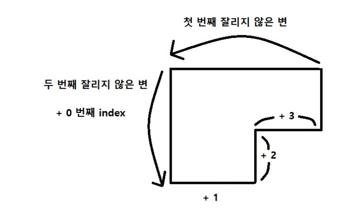

### 문제주소: [2477 참외밭](https://www.acmicpc.net/problem/2477)
### 참조블로그: [참외밭 설명](https://kau-algorithm.tistory.com/11)
```
이 문제는 풀이방법이 많다.
나는 그 중에서, 다음의 방식을 사용했다.

큰 사각형에서 작은사각형을 빼는 방법
 +
잘리지 않은 변으로 작은사각형 찾기
```

```
반 시계방향으로 돌아가는 변들의 정보는,
그림과같이 잘리지않은 변이 연속으로 두번 나온경우,
마지막 잘리지 않은변 인덱스 +2 와 인덱스+3 위치의
변을 곱하면, 작은 사각형의 면적을 구할 수 있다.

그러므로 다음과같은 순서대로 진행하면된다.

1. 큰 사각형 면적을 찾아라
1-1. 동쪽 혹은 서쪽의 변중 가장 큰 변을 찾는다.
1-2. 북쪽 혹은 남쪽의 변중 가장 큰 변을 찾는다.
1-3. 그 둘을 곱하면, 큰 사각형 면적이 나온다.


2. 작은 사각형 면적을 찾아라
2-1. 입력값을 순회하면서, 1-1, 1-2에서 찾은 변이 나오면, 탈출한다.
2-2. 마지막변의 + 2 인덱스와 +3 인덱스 변의 길이를 곱해서 작은 사각형 면적을 찾는다.


3. ( 큰 사각형 - 작은사각형 ) * 수확량
```
