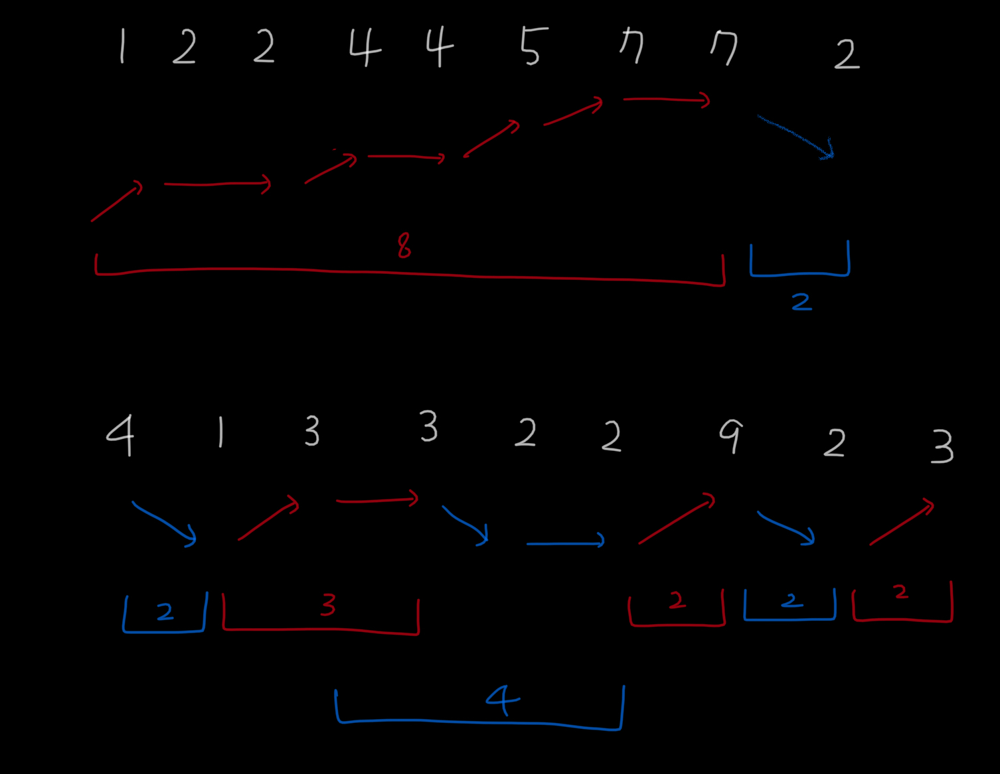

수열 - [2491](https://www.acmicpc.net/problem/2491)
===
---


문제
---
~~~
0에서부터 9까지의 숫자로 이루어진 N개의 숫자가 나열된 수열이 있다. 

그 수열 안에서 연속해서 커지거나(같은 것 포함), 혹은 연속해서 작아지는(같은 것 포함) 수열 중 가장 길이가 긴 것을 찾아내어 그 길이를 출력하는 프로그램을 작성하라. 

예를 들어 수열 1, 2, 2, 4, 4, 5, 7, 7, 2 의 경우에는 1 ≤ 2 ≤ 2 ≤ 4 ≤ 4 ≤ 5 ≤ 7 ≤ 7 이 가장 긴 구간이 되므로 그 길이 8을 출력한다. 

수열 4, 1, 3, 3, 2, 2, 9, 2, 3 의 경우에는 3 ≥ 3 ≥ 2 ≥ 2 가 가장 긴 구간이 되므로 그 길이 4를 출력한다. 

또 1, 5, 3, 6, 4, 7, 1, 3, 2, 9, 5 의 경우에는 연속해서 커지거나 작아지는 수열의 길이가 3 이상인 경우가 없으므로 2를 출력하여야 한다.
~~~
---
문제 풀이
---

### 같은 값이 연속된 경우
진행 방향이 바뀌더라도 같은 값 연속 길이는 새로운 수열에 따라감

##

```java
import java.io.*;
import java.util.*;

public class BOJ2491 {
    public static void main(String[] args) throws Exception{
        BufferedReader br = new BufferedReader(new InputStreamReader(System.in));
        int N = Integer.parseInt(br.readLine());
        int[] sequence = new int[N];

        StringTokenizer st = new StringTokenizer(br.readLine());
        //수열 입력
        for(int i = 0 ; i < N ; i++){
            sequence[i] = Integer.parseInt(st.nextToken());
        }

        int count = 1;          //수열 길이
        int same = 1;           //똑같은 수 길이
        boolean direction = true; //false : 감소 방향, true : 증가 방향
        int max_count = 0;      //가장 긴 수열 길이

        for(int i = 1 ; i < N ; i++){
            if(sequence[i-1] < sequence[i]){
                //1. 수열 증가 방향 & i-1보다 i 값이 큰 경우
                if(direction) {
                    count++;
                }
                //2. 수열 감소 방향 & i-1 보다 i 값이 큰 경우 -> 방향 전환
                else{
                    if(count > max_count) max_count = count;    //이전까지의 수열 길이 비교 후 큰 값 저장
                    count = same + 1;                           //같은 수 연속된 길이에 자기 자신 길이 더함
                    direction = true;                           //증가 방향으로 전환
                }
                same = 1;                                       //이전 값과 다른 값의 수열이므로 같은 수 연속 길이 = 1
            }else if(sequence[i-1] > sequence[i]){
                //3. 수열 증가 방향 & i-1이 i 값보다 큰 경우 -> 방향 전환
                if(direction){
                    if(count > max_count) max_count = count;
                    count = same + 1;
                    direction = false;                          //감소 방향으로 전환
                }
                //4. 수열 감소 방향 && i-1이 i값보다 작은 경우
                else{
                    count++;
                }
                same = 1;
            }
            //5. i-1값 == i값
            else{
                same++;
                count++;
            }
        }
        System.out.println(max_count > count ? max_count : count);
    }
}
```
