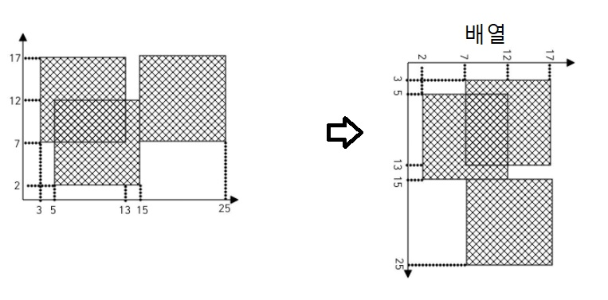

### 문제주소: [2563 색종이](https://www.acmicpc.net/problem/2563)
---
```
이 문제는, 100X100 도화지 안에 10X10의 정사각형 색종이를 붙이는 문제다.

다시말하면,

100X100 배열에 10x10칸을 반복해서 채운다고 할 수 있다.
```


```
1. 100 x 100 배열 생성

2. 색종이가 차지하는 칸의 배열을 칠하면서, 만약 이미 칠해져있으면 넘어가고, 색칠이 되어있지 않으면 색칠 후 색칠된 칸의 개수를 늘린다.

3. 색칠된 칸의 개수 출력

```