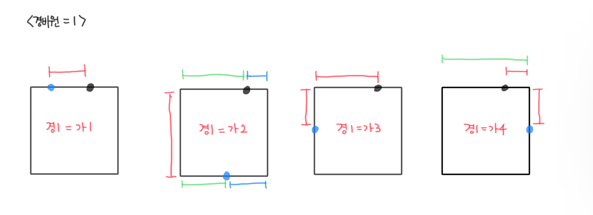
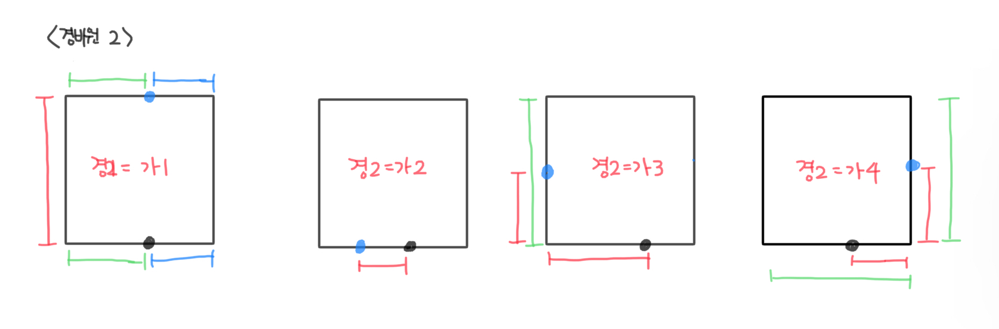
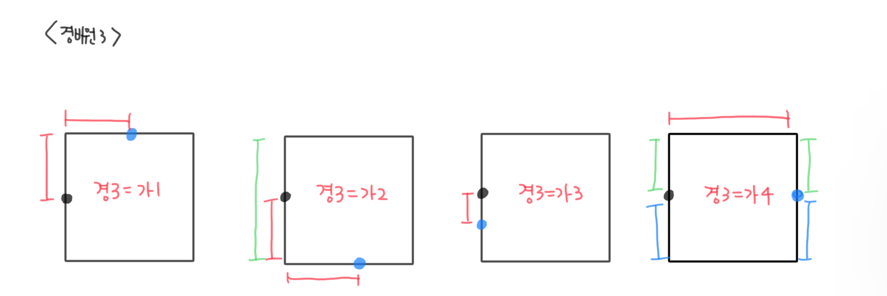
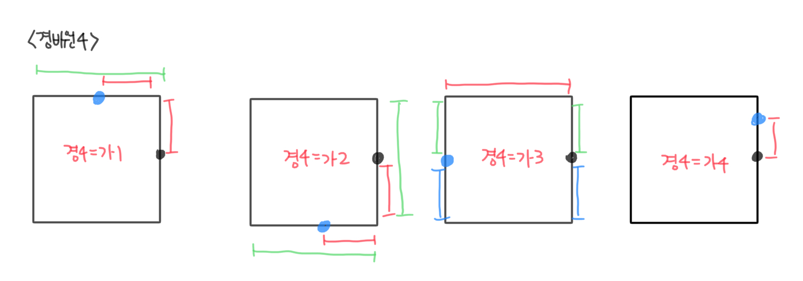

경비원 - [2564](https://www.acmicpc.net/problem/2564)
===
---

문제
---

문제 풀이
---

블록의 가로 길이 A
블록의 세로 길이 B

경비원 위치 a
가게 위치 b

1. 경비원과 가게가 같은 line에 존재 : |a - b|
   (1 - 1 / 2 - 2 / 3 - 3 / 4 - 4)

2. 경비원과 가게가 서로 반대편에 존재
   1) line 1 or 2:
   
      B + min(a + b, A - a + A - b)
   
      (1 - 2 / 2 - 1)
   
   2) line 3 or 4:
   
      A + min(a + b, (B - a + A - a))
   
      (3 - 4 / 4 - 3)
   
3. 경비원과 가게가 서로 옆면에 존재

   (1 - 3 / 1 - 4 / 2 - 3 / 2 - 4 / 3 - 1 / 3 - 2 / 4 - 1 / 4 - 2)

    1) 1 - 3  or 3 - 1
   
       a + b
   
    2) 1 - 4 or 4 - 1
   
       (A - a) + b | (A - b) + a
   
    3) 2 - 3 or 3 - 2
   
       a + (B - b) | b + (B - a)
   
    4) 2 - 4 | 4 - 2
   
       (A - a) + (B - b) | (A - b) + (B - a)