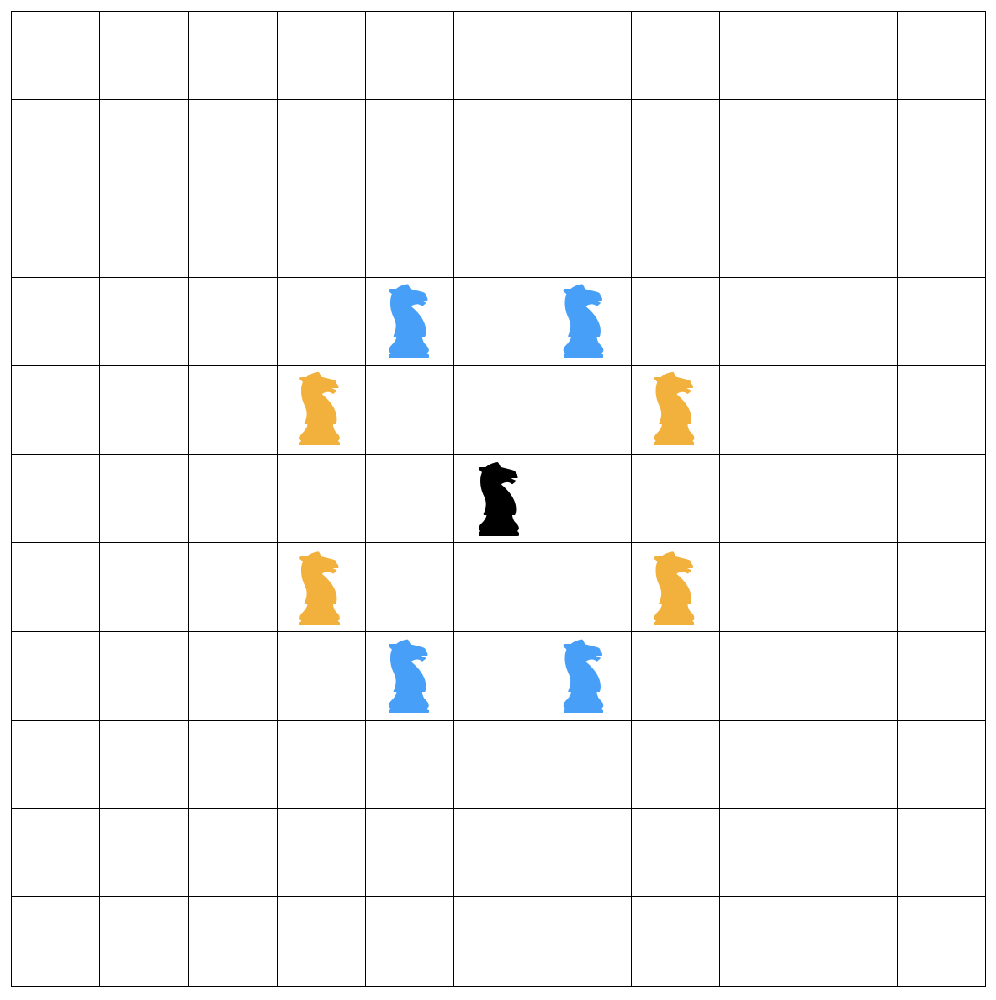

나이트투어 - [1331](https://www.acmicpc.net/problem/1331)
===

문제
---
~~~
나이트 투어는 체스판에서 나이트가 모든 칸을 정확히 한 번씩 방문하며, 마지막으로 방문하는 칸에서 시작점으로 돌아올 수 있는 경로이다.
영식이는 6×6 체스판 위에서 또 다른 나이트 투어의 경로를 찾으려고 한다. 
체스판의 한 칸은 A, B, C, D, E, F 중에서 하나와 1, 2, 3, 4, 5, 6 중에서 하나를 이어 붙인 것으로 나타낼 수 있다. 
영식이의 나이트 투어 경로가 주어질 때, 이것이 올바른 것이면 Valid, 올바르지 않으면 Invalid를 출력하는 프로그램을 작성하시오.
~~~

문제풀이
---


**[8방 탐색 응용]**

즉, 입력된 다음 경로와 현재 말에서의 8방 탐색 지점이 일치하는 지 확인하고

일치하는 경우 탐색 계속해서 진행

일치하지 않으면 나이트가 이동하지 못하는 경로이므로 탐색 종료


코드
---

```java
import java.io.*;
import java.util.*;
public class BOJ1331 {
    public static void main(String[] args) throws Exception{
        BufferedReader br = new BufferedReader(new InputStreamReader(System.in));
        int[] di = {-2, -2, -1, -1, 1, 1, 2, 2};
        int[] dj = {-1, 1, -2, 2, -2, 2, -1, 1};
        int[][] moves = new int[37][2];//입력 전부 저장(0~35까지는 입력값, 36은 처음 시작점)
        for(int i = 0 ; i < 36 ; i++){
            String move = br.readLine();
            moves[i][0] = move.charAt(0) - 'A';
            moves[i][1] = move.charAt(1) - '1';
        }
        moves[36] = moves[0];

        int idx = 0;
        boolean[][] visit = new boolean[6][6]; //체스판 각 칸 방문 여부

        while(idx < 36){ //36번 탐색
            int[] cur = moves[idx];   //현재위치
            int[] next = moves[idx+1]; //다음에 이동할 위치

            visit[cur[0]][cur[1]] = true; //현재위치 방문 체크
            int dif_x = cur[0] - next[0]; //현재위치와 다음 위치의 x값 거리 계산
            int dif_y = cur[1] - next[1]; //현재위치와 다음 위치의 y값 거리 계산
            boolean isPos = false;        //이동 가능여부 판단
            for(int d = 0 ; d < 8 ; d++){
                if(di[d] == dif_x && dj[d] == dif_y){  //현재위치와 다음 위치의 거리와 8방탐색 일치여부 확인
                    //나이트가 이동 가능한 거리라면 탐색 종료
                    isPos = true;
                    break;
                }
            }

            //탐색 불가능하면 탐색 종료 및 Invalid
            if(!isPos){
                System.out.println("Invalid");
                return;
            }
            //아직 전체 탐색 완료 못했는데 이미 방문한 지역 방문하려는 경우 전체 탐색 불가능
            if(visit[next[0]][next[1]] && idx != 35){
                System.out.println("Invalid");
                return;
            }
            idx++;
        }

        //전체 탐색 무사히 종료한 경우 탐색 가능한 경로
        System.out.println("Valid");
    }
}
```

